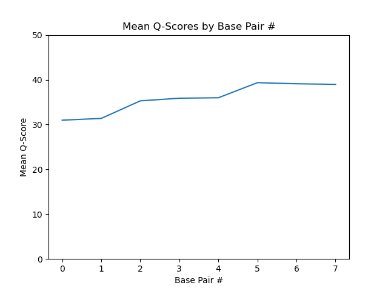
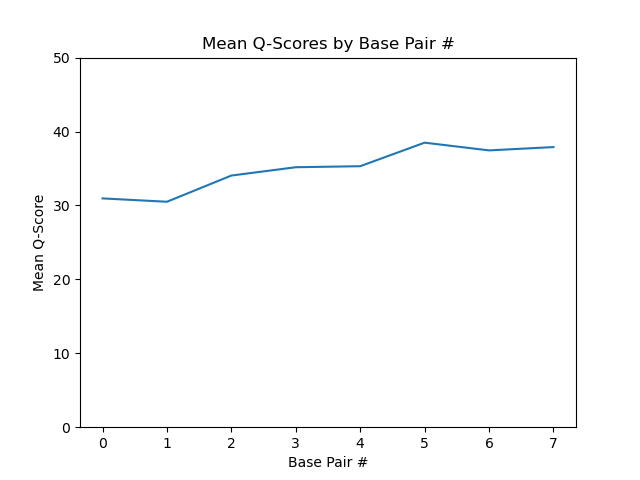
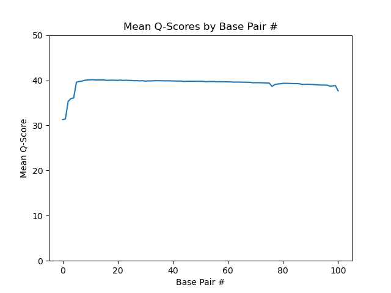
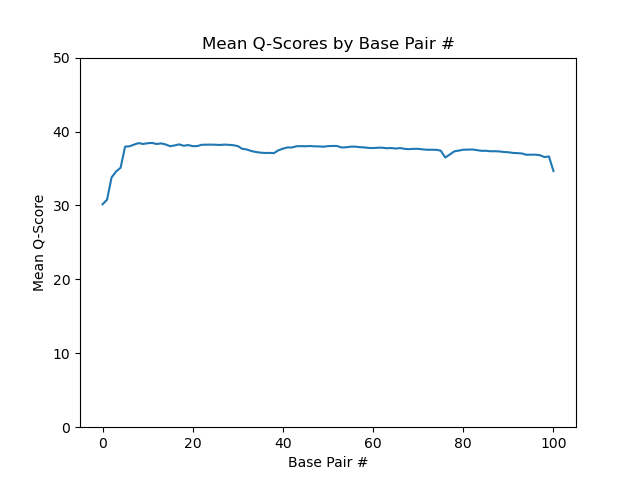

# Assignment the First

## Part 1
1. Be sure to upload your Python script. Provide a link to it here:

| File name | label | Read length | Phred encoding |
|---|---|---|---|
| 1294_S1_L008_R1_001.fastq.gz | read 1 | 101 | +33 |
| 1294_S1_L008_R2_001.fastq.gz | index 1 | 8 | +33 |
| 1294_S1_L008_R3_001.fastq.gz | index 2 | 8 | +33 |
| 1294_S1_L008_R4_001.fastq.gz | read 2 | 101 | +33 |

2. Per-base NT distribution
    1. Use markdown to insert your 4 histograms here.
    
    
    
    

```
$ zcat /projects/bgmp/shared/2017_sequencing/1294_S1_L008_R2_001.fastq.gz | sed -n '2~4p' | grep -E -c "N"
3976613
$ zcat /projects/bgmp/shared/2017_sequencing/1294_S1_L008_R3_001.fastq.gz | sed -n '2~4p' | grep -E -c "N"
3328051
```
## Part 2
1. Define the problem
```
Problem is to take 4 FASTQ files (2 biological reads, 2 index reads) and do the following: (1) incorporate index reads to the header lines of all biological reads in the format "index1-index2" and (2) write all biological reads (with the new headers) into new FASTQ files according to their indices.
```
2. Describe output
```
The expected output is 52 FASTQ files—2 for each of the 24 valid index pairs, plus 2 for index-hopped reads, and 2 for unknown reads (indices below the Q-score cutoff or containing "N" reads)
```
3. Upload your [4 input FASTQ files](../TEST-input_FASTQ) and your [>=6 expected output FASTQ files](../TEST-output_FASTQ).

4. Pseudocode

    [Demultiplex_Pseudocode](./Demultiplex_Pseudocode.pdf)

5. High level functions. For each function, be sure to include:
    1. Description/doc string
    2. Function headers (name and parameters)
    3. Test examples for individual functions
    4. Return statement
```py
def revcomp(seq: str) -> str:
    ```Takes input DNA sequence and returns its reverse complement``` 
    return seq_rc
Input: ATGTCNG
Output: CNGACAT
```
```py
def check_qscore(qscores: str, cutoff: int,phred=33) -> bool:
    ```Converts qscore string to integer values, then checks if the mean is greater than the cutoff```
    return bool(mean_qscore > cutoff)
Input: #?@AB<@, cutoff=30
Output: False
```
```py
def get_record(file) -> tuple:
    ```Takes input FASTQ filehandle and reads the next 4 lines, extracting the header, sequence, and qscore from that record.```
    return header, sequence, qscore
Input: FASTQ filehandle (line ptr at x, with next line being a header)
Output: header, sequence, and qscore (line ptr now at x+4)
```
